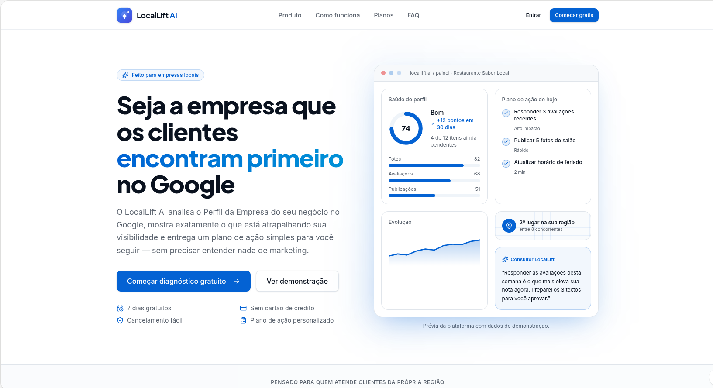
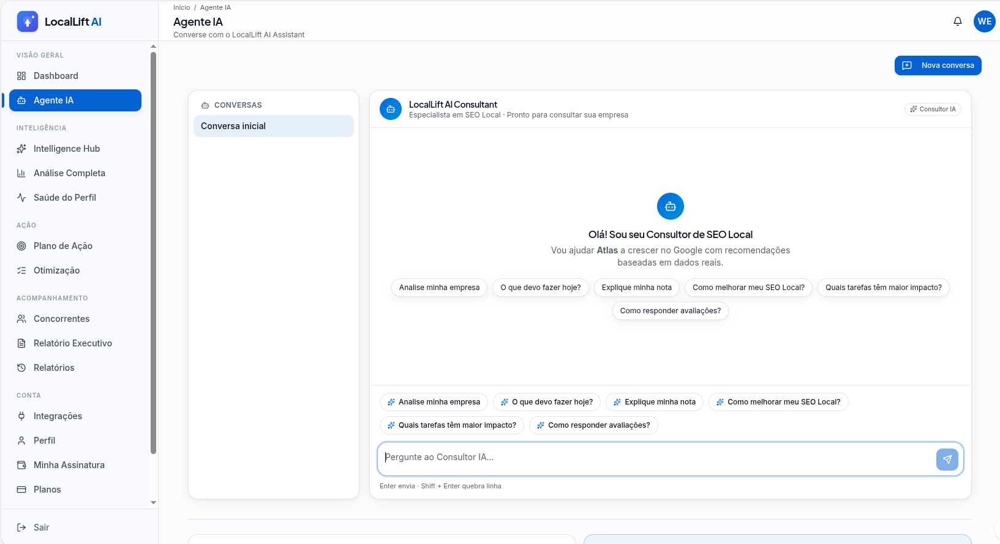
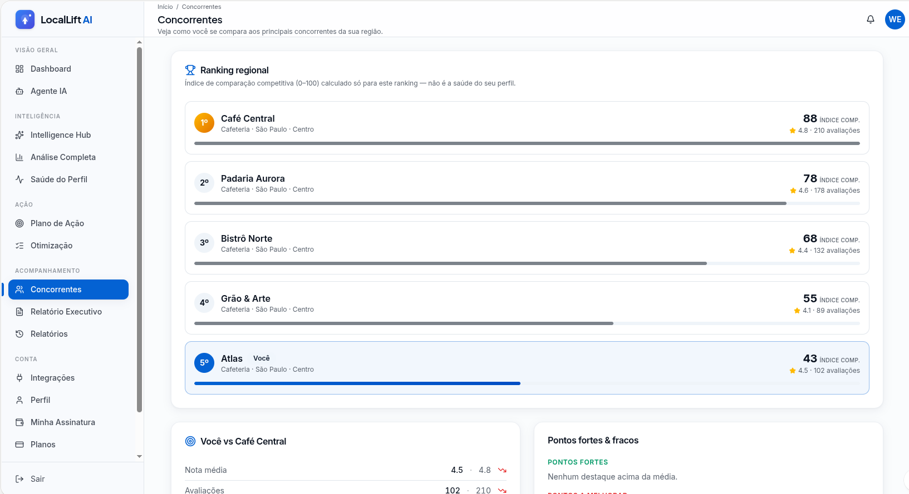
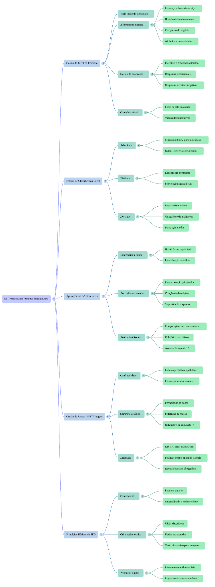
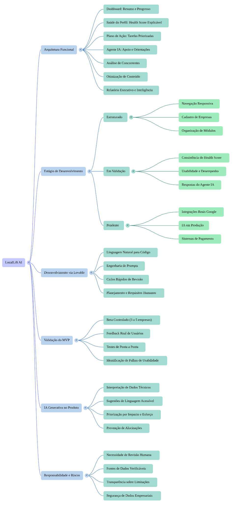

# NotebookLM — IA generativa aplicada à presença digital local

Projeto desenvolvido como parte de um desafio da [DIO](https://www.dio.me/) para criar um caderno temático no NotebookLM, selecionar fontes confiáveis e produzir conhecimento fundamentado nelas.

## Tema

**IA generativa aplicada à presença digital de negócios locais: o LocalLift AI como estudo de caso.**

O projeto investiga como a IA generativa pode interpretar dados de presença digital, explicar problemas em linguagem acessível e sugerir ações priorizadas para pequenos negócios, sem substituir a decisão humana.

## Caderno no NotebookLM

> **[Acessar o caderno completo no NotebookLM](https://notebook.google.com/notebook/1b1854c7-615a-4628-a8b4-de872ef1f15f)**  
> É necessário entrar em uma Conta Google para visualizar o notebook.

## Problema estudado

Pequenos empreendedores precisam manter informações comerciais corretas, acompanhar avaliações, interpretar métricas e obedecer às diretrizes do Google. A falta de tempo e de conhecimento técnico dificulta a identificação das ações mais importantes.

## Solução analisada

O **LocalLift AI** é um SaaS em desenvolvimento que propõe:

- diagnóstico da saúde do Perfil da Empresa;
- Health Score explicável;
- plano de ação priorizado;
- agente de IA para orientações;
- análise de concorrentes;
- apoio à otimização de conteúdo;
- relatório executivo.

O projeto está em preparação para um beta controlado. A interface e a estrutura dos módulos estão desenvolvidas, enquanto o Health Score, o agente de IA e a análise de concorrentes ainda precisam ser validados. Integrações reais com serviços do Google, provedor de IA, pagamentos e e-mails permanecem pendentes.

## LocalLift AI na prática

As telas abaixo apresentam o protótipo utilizado como estudo de caso. Os dados exibidos são demonstrativos e não representam resultados garantidos.

### Página inicial

Apresentação da proposta de valor do LocalLift AI para empresas locais.

### Agente IA

Interface do consultor de SEO local, projetada para transformar diagnósticos em orientações acessíveis. O recurso permanece em validação.

### Análise de concorrentes

Comparação regional demonstrativa para identificar diferenças e oportunidades. As pontuações e empresas exibidas são exemplos de teste.

## Conteúdos produzidos no caderno

- síntese central;
- teste de fundamentação nas fontes;
- glossário de conceitos;
- análise crítica;
- perguntas e respostas estratégicas;
- dois mapas mentais;
- resumo em áudio.

## Estrutura do repositório

- [Síntese do estudo](docs/sintese.md)
- [Análise crítica](docs/analise-critica.md)
- [Glossário](docs/glossario.md)
- [Perguntas estratégicas](docs/perguntas-estrategicas.md)
- [Teste de fundamentação](docs/teste-fundamentacao.md)
- [Prompts utilizados](prompts/prompts-utilizados.md)
- [Fontes consultadas](fontes/fontes-utilizadas.md)
- [Documento-base do estudo de caso](documentos/LocalLift_AI_Estudo_de_Caso.docx)
- [Resumo em áudio do NotebookLM](audio/resumo-audio-locallift-ai.mp3)

## Resumo em áudio

O NotebookLM também produziu uma conversa em áudio sobre como a IA pode traduzir informações do Google para pequenos lojistas.

**[Ouvir ou baixar o resumo em áudio](audio/resumo-audio-locallift-ai.mp3)** — duração aproximada de 21 minutos.

## Mapas mentais

### IA generativa e presença digital local

### Estrutura e validação do LocalLift AI

## Principais conclusões

A IA generativa pode reduzir a complexidade dos dados e apoiar a tomada de decisão, mas não garante melhor posicionamento, vendas ou resultados comerciais. O valor do LocalLift AI dependerá da qualidade dos dados, da validação com empresas reais, da conclusão das integrações e da revisão humana das recomendações.

## Tecnologias e ferramentas

- NotebookLM
- IA generativa e modelos de linguagem
- Lovable
- GitHub
- Perfil da Empresa no Google

## Autoria

Projeto acadêmico desenvolvido por **Well60** para o curso da DIO.
